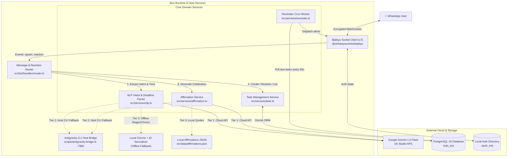
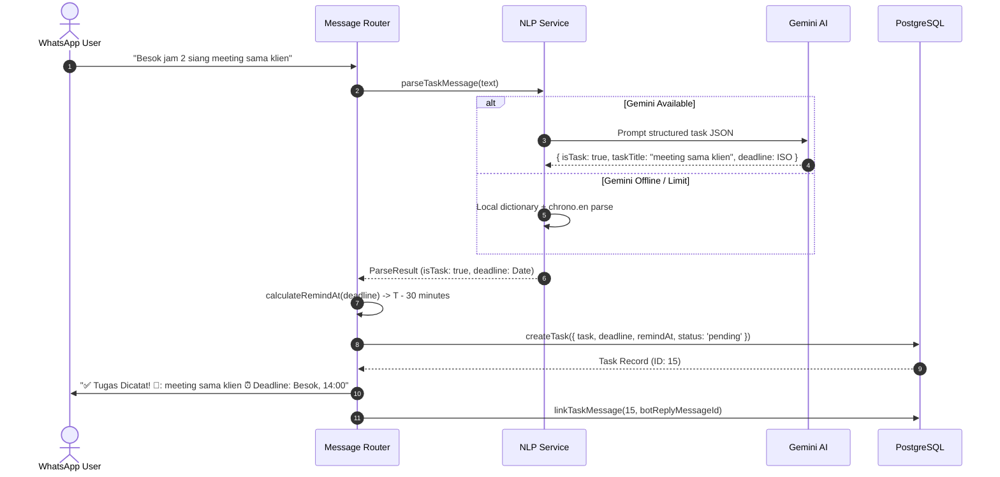
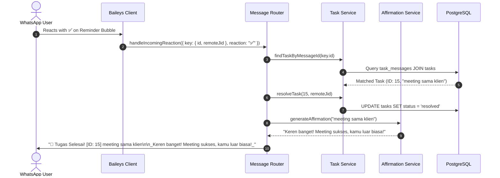
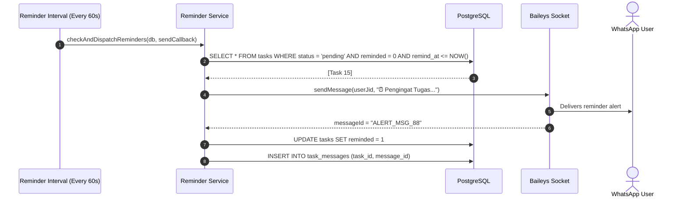
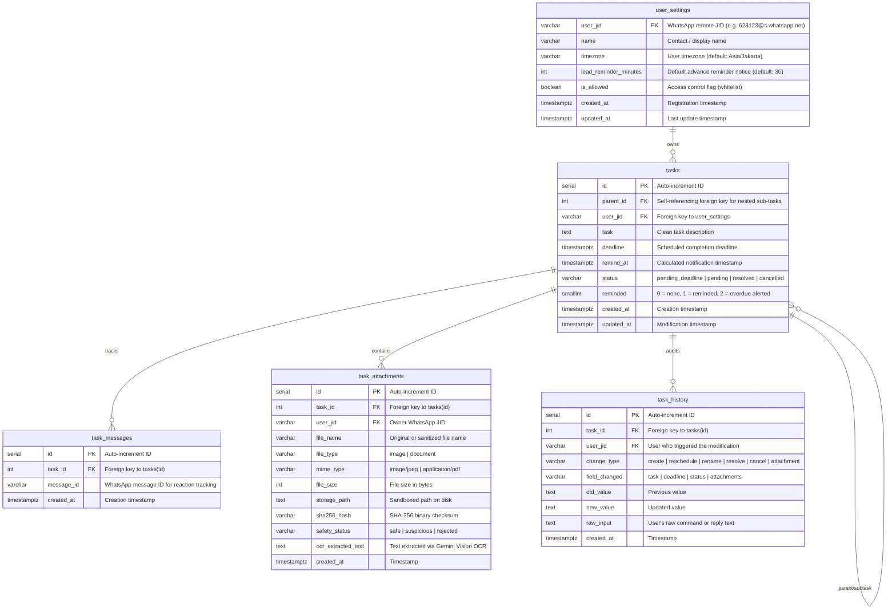

# System Architecture & Technical Design

This document details the software architecture, data flow, component boundaries, and resiliency patterns for the WhatsApp Task & Reminder Bot.

---

## 1. High-Level Architecture

The system is designed as a modular, lightweight daemon executed under the **Bun** runtime. It maintains a persistent WebSocket connection to WhatsApp using `@whiskeysockets/baileys` and connects to **PostgreSQL** via Drizzle ORM.

---

## 2. Core Components & Responsibilities

| Component | Path | Responsibility |
| :--- | :--- | :--- |
| **Client Manager** | `src/bot/client.ts` | Manages Baileys socket lifecycle, QR code generation in terminal, auth credentials persistence in `./auth_info`, and initiates background interval timers. |
| **Router** | `src/bot/handlers/router.ts` | Dispatches incoming messages, validates whitelist permissions, handles commands (`/help`, `/list`, `/selesai`, `/batal`), maps quoted replies, and processes emoji reactions. |
| **NLP Service** | `src/services/nlp.ts` | Classifies task intent, strips conversational noise, normalizes Indonesian temporal phrases, extracts deadline timestamps, and delegates to Gemini with local fallback. |
| **Task Service** | `src/services/task.ts` | Handles database operations (`tasks`, `task_messages`, `user_settings`), status transitions (`pending_deadline`, `pending`, `resolved`, `cancelled`), and message-to-task correlation. |
| **Reminder Worker** | `src/services/reminder.ts` | Calculates adaptive `remind_at` offsets, queries due and overdue tasks every 60 seconds, dispatches alerts, and updates notification flags. |
| **Affirmation Service** | `src/services/affirmation.ts` | Produces positive congratulatory feedback tailored to the completed task using Gemini 1.5 Flash or local curated Indonesian affirmations. |
| **Database Pool** | `src/db/index.ts` & `src/db/schema.ts` | Configures `postgres.js` connection pool and declares type-safe Drizzle ORM schemas. |

---

## 3. Data Flows & Workflows

### 3.1 Task Ingestion & Adaptive Reminder Calculation

### 3.2 Task Resolution via Reaction or Reply

### 3.3 Reminder Dispatcher Loop

---

## 4. Database Entity-Relationship Diagram (ERD)

---

## 5. Security & Isolation Architecture

1. **Multi-Layer Media & Attachment Security Pipeline**:
   - **Layer 1: Magic Bytes / Binary Gatekeeper (`file-type`)**: Validates real file signature against whitelist (`image/jpeg`, `image/png`, `image/webp`, `application/pdf`). Explicitly blocks executable binaries and text vectors like SVG/XML (XSS vectors). Enforces size caps (5MB images, 10MB PDFs).
   - **Layer 2: Content Disarming & Reconstruction (CDR) with Sharp**: Strips dangerous hidden chunks, auto-orients, and sanitizes images into pure, normalized JPEGs, neutralizing polyglots and steganography.
   - **Layer 3: Gemini Multimodal AI Screening & OCR**: Inspects visual content for fraudulent bank transfers, scam/phishing indicators, and malicious links before acceptance. Performs OCR extraction on physical invoices and notes.
   - **Layer 4: S3 Object Storage (Rust FS) & Sandboxed Local Storage**: Mendukung S3-compatible Object Storage (container Rust FS / MinIO via internal Docker network) serta penyimpanan lokal terisolasi (`./storage/attachments/YYYY/MM/UUID.ext`) dengan izin akses ketat (`0o600`).
   - **Direct Media Reminder Dispatcher**: Saat interval pengingat tiba, jika tugas memiliki lampiran gambar atau dokumen, bot mengambil buffer file dari S3 Rust FS (atau local storage) dan mengirimkannya langsung ke WhatsApp dengan teks pengingat ramah sebagai caption. ID pesan yang terkirim dihubungkan ke `task_messages` sehingga reaksi emoji (✅ / ❌) pada balon media berfungsi penuh.
2. **Network Attack Surface**:
   - Zero inbound listening HTTP ports. Baileys connects exclusively via an outbound WebSocket directly to WhatsApp infrastructure (`*.whatsapp.net`).
   - The bot server is immune to internet-wide port scans, external HTTP exploits, or unauthorized webhooks.
3. **Database Isolation**:
   - PostgreSQL connections use credentialed TCP (`DATABASE_URL`).
   - Can run entirely inside Docker network bridges or bind strictly to `localhost:5432`.
4. **Session Credentials**:
   - Signal keys, pre-keys, and tokens are stored in the local `./auth_info` volume, guarded with restricted file permissions, and never transmitted over external networks.
5. **Access Control**:
   - Incoming messages from unauthorized JIDs are immediately dropped if `is_allowed = false` in `user_settings`.
   - The bot ignores group chats (`@g.us`) and status broadcasts (`status@broadcast`) to prevent spam or token exhaustion.
