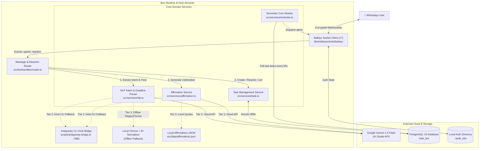
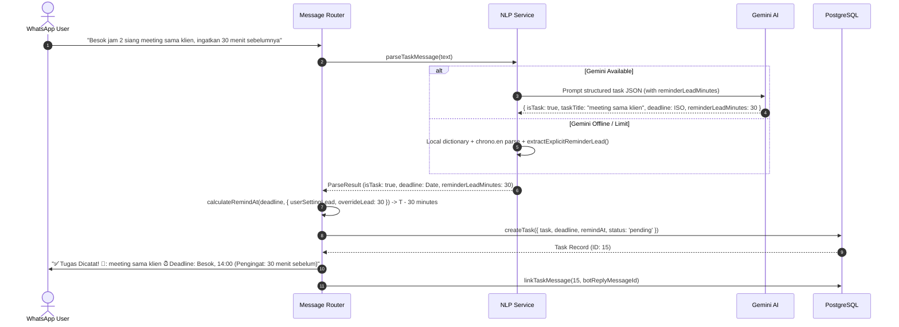
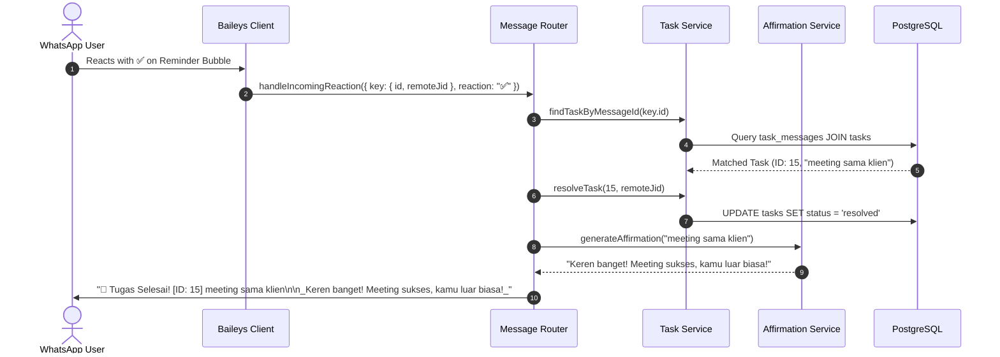
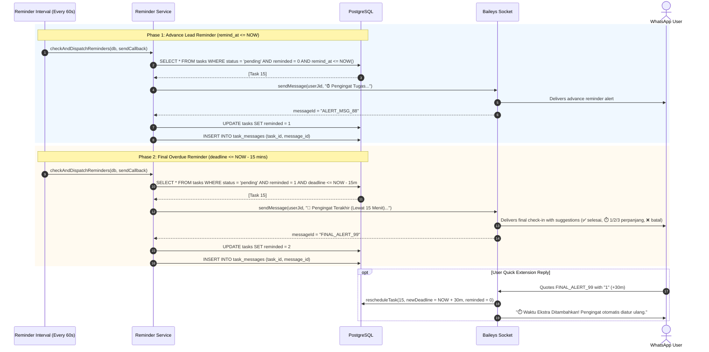
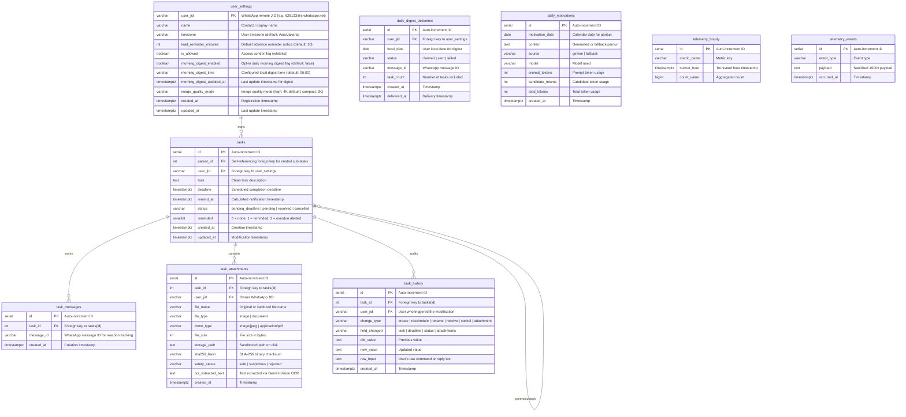

# System Architecture & Technical Design

This document details the software architecture, data flow, component boundaries, and resiliency patterns for the WhatsApp Task & Reminder Bot.

---

## 1. High-Level Architecture

The system is designed as a modular, lightweight daemon executed under the **Bun** runtime. It maintains a persistent WebSocket connection to WhatsApp using `@whiskeysockets/baileys` and connects to **PostgreSQL** via Drizzle ORM.

---

## 2. Core Components & Responsibilities

| Component | Path | Responsibility |
| :--- | :--- | :--- |
| **Client Manager** | `src/bot/client.ts` | Manages Baileys socket lifecycle, QR code generation in terminal, auth credentials persistence in `./auth_info`, and initiates background interval timers. |
| **Router** | `src/bot/handlers/router.ts` | Dispatches incoming messages, validates whitelist permissions, handles commands (`/help`, `/list`, `/selesai`, `/batal`), maps quoted replies, and processes emoji reactions. |
| **NLP Service** | `src/services/nlp.ts` | Classifies task intent, strips conversational noise, normalizes Indonesian temporal phrases, extracts deadline timestamps, and delegates to the configured LLM chain with a local parser as the last tier. |
| **LLM chain** | `src/services/llm/` | Provider adapters (Gemini, OpenAI-compatible, Anthropic, Antigravity), per-attempt cancellation, total time budget, output validation, and a circuit breaker per provider. Order comes from `LLM_CHAIN_*`. |
| **Task Service** | `src/services/task.ts` | Handles database operations (`tasks`, `task_messages`, `user_settings`), status transitions (`pending_deadline`, `pending`, `resolved`, `cancelled`), and message-to-task correlation. |
| **Reminder Worker** | `src/services/reminder.ts` | Calculates adaptive `remind_at` offsets, queries due and overdue tasks every 60 seconds, dispatches alerts, and updates notification flags. |
| **Morning Digest** | `src/services/morning-digest.ts` | Dispatches opt-in daily morning task summaries at configured local time with cached AI/local pantun motivation. |
| **Media Service** | `src/services/media.ts` | Multi-layer media validation (magic bytes), CDR sanitization via Sharp (configurable 4K high vs 2K compact), S3/local storage, and AI screening. |
| **Telemetry Service** | `src/services/telemetry.ts` | Records hourly aggregated runtime metrics, sanitizes and logs error events, and feeds dashboard telemetry. |
| **Monitoring Dashboard** | `src/dashboard/server.ts` | Lightweight HTTP Basic Auth web dashboard (port 3080) for real-time monitoring of bot status, socket, memory, tasks, and telemetry. |
| **Affirmation Service** | `src/services/affirmation.ts` | Produces positive congratulatory feedback tailored to the completed task using Gemini 1.5 Flash or local curated Indonesian affirmations. |
| **Database Pool** | `src/db/index.ts` & `src/db/schema.ts` | Configures `postgres.js` connection pool and declares type-safe Drizzle ORM schemas. |

---

## 3. Data Flows & Workflows

### 3.1 Task Ingestion & Adaptive Reminder Calculation

### 3.2 Task Resolution via Reaction or Reply

### 3.3 Reminder Dispatcher Loop & 15-Minute Overdue Grace

#### Per-chat pacing (anti-spam)

Both phases are queried up front and grouped per user. Users are processed in parallel (max 4), while one user's reminders go out sequentially, earliest due first. Every automated send (reminders and the morning digest) goes through `createSendPacer` (`src/services/send-pacer.ts`):

- a jittered **20–30s gap** between two automated messages to the **same chat** (`REMINDER_PACING_MIN_MS` / `REMINDER_PACING_MAX_MS`, min ≥ 6s = WhatsApp pair rate limit, Cloud API error `131056`);
- a **1s global gap** between any two automated sends, so many users due at the same minute do not form a burst;
- at most **2 reminders per user per cycle**; the rest stay `reminded = 0` / `1` and go out on the next 60s tick, so pacing never blocks the scheduler.

Replies to user messages are not paced: they answer a message the user just sent.

### 3.4 Same-Schedule Confirmation

When a new task (or a `pending_deadline` task receiving its time) has a deadline in the **same minute** as another `pending` task of the same user, the router stores it as `pending_confirmation` (never reminded) and asks casually whether to keep it:

- `gas` / `ya` / `lanjut` / `gapapa` → `confirmTask` → `pending` (history `confirm`);
- another time (e.g. `jam 14:30`, kept on the held task's day) → re-checked for collisions, then `pending`;
- `batal` / `ga jadi` → `cancelled`; the existing task is untouched.

The reply is matched by quoting the prompt, or by the latest `pending_confirmation` task within 15 minutes. Unrelated messages fall through to normal routing, so the prompt never blocks the user.

---

## 4. Database Entity-Relationship Diagram (ERD)

---

## 5. Security & Isolation Architecture

1. **Multi-Layer Media & Attachment Security Pipeline**:
   - **Layer 1: Magic Bytes / Binary Gatekeeper (`file-type`)**: Validates real file signature against whitelist (`image/jpeg`, `image/png`, `image/webp`, `application/pdf`). Explicitly blocks executable binaries and text vectors like SVG/XML (XSS vectors). Enforces size caps (5MB images, 10MB PDFs).
   - **Layer 2: Content Disarming & Reconstruction (CDR) with Sharp**: Strips dangerous hidden chunks, auto-orients, and sanitizes images into pure, normalized JPEGs, neutralizing polyglots and steganography. Menjaga batas dimensi aman (`fit: 'inside'`, `withoutEnlargement: true`) dengan mode High 4K (4096px, default) atau Compact 2K (2048px) untuk mencegah serangan dekompresi *Pixel Flood / Decompression Bomb*.
   - **Layer 3: Gemini Multimodal AI Screening & OCR**: Inspects visual content for fraudulent bank transfers, scam/phishing indicators, and malicious links before acceptance. Performs OCR extraction on physical invoices and notes.
   - **Layer 4: S3 Object Storage (Rust FS) & Sandboxed Local Storage**: Mendukung S3-compatible Object Storage (container Rust FS / MinIO via internal Docker network) serta penyimpanan lokal terisolasi (`./storage/attachments/YYYY/MM/UUID.ext`) dengan izin akses ketat (`0o600`).
   - **Direct Media Reminder Dispatcher**: Saat interval pengingat tiba, jika tugas memiliki lampiran gambar atau dokumen, bot mengambil buffer file dari S3 Rust FS (atau local storage) dan mengirimkannya langsung ke WhatsApp dengan teks pengingat ramah sebagai caption. ID pesan yang terkirim dihubungkan ke `task_messages` sehingga reaksi emoji (✅ / ❌) pada balon media berfungsi penuh.
2. **Network Attack Surface & Monitoring Dashboard**:
   - Zero public inbound ports for the bot core. Baileys connects exclusively via an outbound WebSocket directly to WhatsApp infrastructure (`*.whatsapp.net`).
   - **Internal Monitoring Dashboard & Control Room (`src/dashboard/`)**: Dashboard pemantauan dan administrasi operasional bot pada port 3080 (`DASHBOARD_PORT`). Bersifat opsional (`DASHBOARD_ENABLED=false` secara default), diproteksi penuh oleh HTTP Basic Authentication (`DASHBOARD_USERNAME`, `DASHBOARD_PASSWORD` minimal 16 karakter), header keamanan ketat (CSP, nosniff, frame denial, no-store), dan terpisah dari WhatsApp runtime socket.
   - **Administrative Capabilities**:
     - *Whitelist & Access Manager*: Mutasi status `is_allowed` per pengguna, penambahan nomor baru secara manual, dan penghapusan kontak terisolasi.
     - *Task Explorer & Detail View*: Query daftar tugas dengan default filter status `active` dan paginasi (20 baris per halaman via query params `offset`/`limit` serta metadata response headers `x-total-count`, `x-offset`, `x-limit`), relasi tugas induk/anak, inspeksi lampiran media, hasil OCR AI, jejak audit perbaikan tugas (*audit trail* dengan `raw_input` trigger), dan panel penyesuaian jadwal tugas (`POST /api/tasks/reschedule`) untuk memodifikasi deadline serta reminder lead time admin.
     - *Cron & Automation Monitoring*: Monitoring siklus scheduler (`Task Reminder Dispatcher`, `Morning Digest Dispatcher`), jeda/aktifkan engine cron secara dinamis, dan pembatalan reminder yang belum berjalan (`POST /api/crons/reminders/disable`) untuk mencegah lonjakan beban atau spam.
   - **Safety Confirmation Safeguards**: Seluruh aksi mutasi yang berpotensi destruktif atau mengubah alur pengiriman pesan diproteksi oleh dialog konfirmasi sadar-admin (*awareness modal confirmation*) di frontend sebelum request HTTP dikirimkan.
3. **Database Isolation**:
   - PostgreSQL connections use credentialed TCP (`DATABASE_URL`).
   - Can run entirely inside Docker network bridges or bind strictly to `localhost:5432`.
4. **Session Credentials**:
   - Signal keys, pre-keys, and tokens are stored in the local `./auth_info` volume, guarded with restricted file permissions, and never transmitted over external networks.
5. **Access Control**:
   - Incoming messages from unauthorized JIDs are immediately dropped if `is_allowed = false` in `user_settings`.
   - The bot ignores group chats (`@g.us`) and status broadcasts (`status@broadcast`) to prevent spam or token exhaustion.
