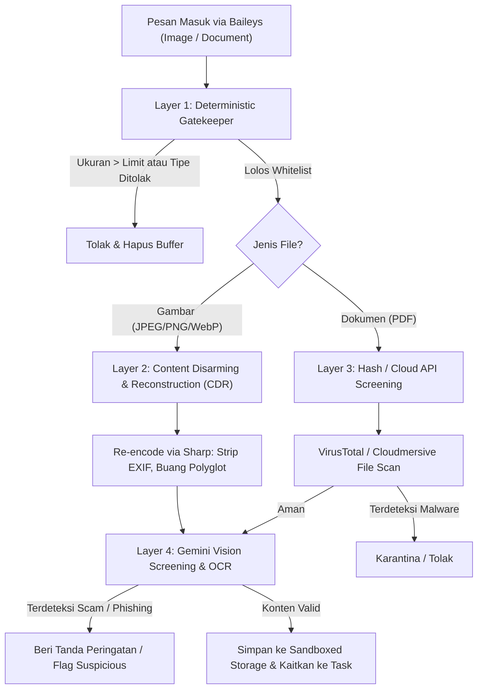
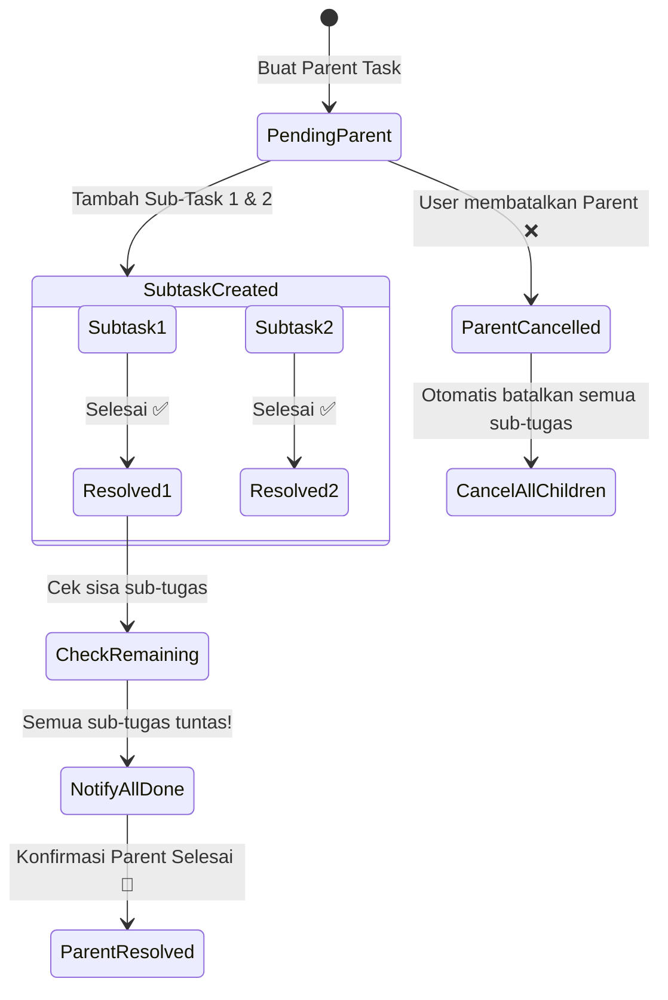
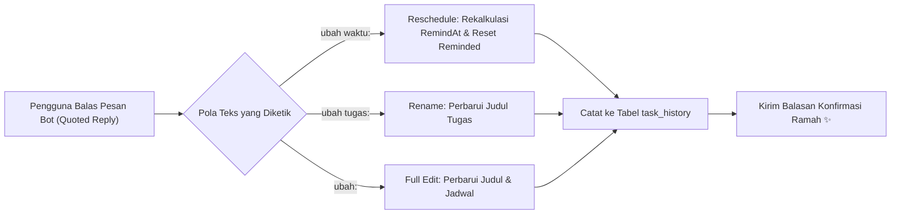

# Riset & Panduan Arsitektur: Attachment Security, Hierarchical Sub-Tasks, & Task Revision (Reschedule & Audit Log)

Dokumen riset ini mengkaji spesifikasi teknis dan *best practice* untuk tiga kapabilitas baru pada **WhatsApp To-Do Reminder Bot**:
1. **Sistem Lampiran Media (Foto & Dokumen)** yang aman dari injeksi malware, virus, scam/phishing, serta eksploitasi server.
2. **Struktur Tugas Bersarang (Hierarchical / Nested Tasks: Parent & Sub-Tasks)** di mana setiap sub-tugas memiliki tenggat waktu (*deadline*) dan jadwal pengingat (*reminder*) yang independen.
3. **Sistem Revisi & Penjadwalan Ulang Tugas (Reschedule & Edit Title)** melalui balasan pesan (*quoted reply*) dengan format standar ramah pengguna, disertai **Audit Trail (Pencatatan Riwayat Perubahan) di PostgreSQL**.

---

## Ringkasan Eksekutif & Keputusan Arsitektur

| Domain | Pendekatan Terbaik (*Recommended Best Practice*) | Pendekatan yang Dihindari (*Anti-Pattern*) |
|---|---|---|
| **Attachment Validation** | **In-memory magic-byte inspection** (`file-type`) + **Strict Whitelist** (JPEG, PNG, WebP, PDF) + **Content Disarming & Reconstruction (CDR)** via `sharp` re-encoding. | Mengandalkan ekstensi nama file atau `mimetype` mentah dari header WhatsApp; mengizinkan file berpotensi eksekusi (.svg, .html, .zip, .exe, .apk). |
| **Malware / Virus Screening** | **Cloud-based Scanner** (VirusTotal API v3 / Cloudmersive) atau **Gemini Multimodal Vision Inspection** untuk deteksi scam & phishing. | Menjalankan daemon **ClamAV lokal** pada VPS target (ClamAV membutuhkan RAM 1.5–3 GB, akan langsung memicu *Out-Of-Memory / OOM Killer* pada VPS 512 MB–1 GB). |
| **Nested Task Data Model** | **Adjacency List Pattern** (Self-referential `parent_id` pada tabel `tasks` yang ada). Setiap sub-task adalah entitas `Task` penuh. | Membuat tabel `subtasks` terpisah yang memotong fungsionalitas `deadline`, `remind_at`, dan `task_messages`. |
| **Reminder Scheduling** | **Unified Interval Dispatcher** (Seam 2): sub-task diperlakukan sebagai task independen dengan pengayaan konteks nama *Parent Task* saat notifikasi dikirimkan. | Membuat *cron scheduler* terpisah untuk sub-task atau membatasi sub-task hanya boleh memiliki deadline yang sama dengan parent. |
| **Task Reschedule & Edit** | **Quoted Reply Berbasis Intent** (`ubah waktu: ...`, `ubah tugas: ...`) + **Rekalkulasi Otomatis** `remind_at` & reset status `reminded = 0`. | Memaksa user mengetik ID tugas secara manual; mengubah `deadline` tanpa memperbarui `remind_at` sehingga reminder tidak pernah terkirim. |
| **Change Tracking / Audit** | **Tabel Relasional Khusus (`task_history`)** dengan pencatatan `old_value`, `new_value`, `change_type`, dan `raw_input`. | Mencatat mutasi jadwal hanya di file log mentah (`console.log`) yang mudah hilang saat restart container dan tidak bisa di-query pengguna. |

---

## 1. Konteks Lingkungan & Batasan Infrastruktur

Berdasarkan kesepakatan arsitektur ([PRD](../PRD-to-do-bot-reminder.md) & [ADR 0001](../adr/0001-postgresql-for-task-storage.md)):
- **Runtime:** Bun v1.2+ pada container Linux.
- **Budget Hardware Target:** **1 vCPU dan RAM 512 MB – 1 GB** (Deploy di Docker / Dokploy / VPS hemat biaya).
- **Library WhatsApp:** `@whiskeysockets/baileys` v7 (Native ESM).
- **Database:** PostgreSQL 16 via `drizzle-orm` dan `postgres.js`.
- **Model AI:** Google Gemini 3.1 Flash-Lite (Multimodal & Text).

> [!CAUTION]
> **Peringatan Kritis Memori (ClamAV vs Host Resource):**
> ClamAV membutuhkan **minimal 1.2–1.5 GB RAM** hanya untuk memuat database virus signature ke memori, dan melonjak hingga **2.4–3 GB RAM** saat *concurrent database reload*. Mencoba menjalankan `clamd` di dalam VPS 512 MB–1 GB akan menyebabkan container bot mati mendadak (*killed by OOM*). Oleh karena itu, proteksi malware pada host hemat biaya **wajib menggunakan arsitektur hybrid**: sanitasi in-memory + screening API eksternal.

---

## 2. Bagian I: Sistem Lampiran (Foto & Dokumen) & Proteksi Keamanan

### 2.1 Threat Modeling (Vektor Ancaman File dari WhatsApp)

WhatsApp mengizinkan pengiriman berbagai jenis biner. Dalam konteks bot otomasi, risiko keamanan mencakup:
1. **MIME/Extension Spoofing:** File `malware.exe` atau script shell `exploit.sh` diganti namanya menjadi `nota.jpg` atau `invoice.pdf`.
2. **Embedded Polyglots & Steganography:** File gambar valid yang menyembunyikan script berbahaya atau shellcode pada chunk metadata/EXIF.
3. **Malicious SVG / HTML (XSS):** File SVG yang berisi tag `<script>` berbahaya yang tereksekusi saat dibuka di browser/dashboard.
4. **Malicious PDF Payloads:** PDF yang menyematkan objek JavaScript (`/Launch`, `/JS`), form phishing, atau link ke malware APK.
5. **Scam, Phishing, & Social Engineering:** Pengguna mengirim bukti transfer perbankan palsu (hasil manipulasi gambar) atau tangkapan layar berisi nomor scam/QRIS palsu untuk menipu sistem.
6. **Decompression & Resource Exhaustion (DoS):** File berukuran sangat besar yang menguras RAM atau storage VPS.

---

### 2.2 Pipeline Keamanan 4 Lapisan (4-Layer Defense in Depth)



#### Layer 1: Deterministic In-Memory Gatekeeper
* **Mekanisme:** Jangan pernah mempercayai nama file (`fileName`) atau header `mimetype` yang dikirim dari WhatsApp.
* Gunakan pemeriksaan **Magic Number / File Signature** nyata pada buffer binary menggunakan library `file-type`:
  ```typescript
  import { fileTypeFromBuffer } from 'file-type';

  const ALLOWED_MIME_TYPES = new Set([
    'image/jpeg',
    'image/png',
    'image/webp',
    'application/pdf',
  ]);

  const MAX_IMAGE_SIZE = 5 * 1024 * 1024;  // 5 MB
  const MAX_DOC_SIZE   = 10 * 1024 * 1024; // 10 MB
  ```
* **Kebijakan Tegas:**
  * Tolak seluruh file `.svg` (vektor XSS paling berbahaya).
  * Tolak file arsip (`.zip`, `.rar`, `.tar`, `.7z`) untuk mencegah zip bomb.
  * Tolak seluruh file executable (`.exe`, `.apk`, `.bat`, `.sh`, `.vbs`, `.js`).
  * Tolak dokumen ber-macro (`.docm`, `.xlsm`).

#### Layer 2: Content Disarming & Reconstruction (CDR) untuk Gambar
* **Mekanisme Sanitasi Biner:**
  Alih-alih menyimpan buffer gambar asli yang berisiko membawa muatan *steganography* atau *buffer overflow exploit*, proses ulang (*re-encode*) buffer gambar melalui pustaka native C++ `sharp`:
  ```typescript
  import sharp from 'sharp';

  export async function sanitizeImage(buffer: Buffer): Promise<{ cleanBuffer: Buffer; format: string }> {
    // Re-encoding secara otomatis merestrukturisasi piksel, membuang chunk liar,
    // dan menghapus seluruh metadata EXIF sensitif (GPS, serial kamera).
    const cleanBuffer = await sharp(buffer)
      .rotate() // Menyesuaikan orientasi EXIF sebelum dibersihkan
      .resize({ width: 2048, height: 2048, fit: 'inside', withoutEnlargement: true })
      .jpeg({ quality: 85, progressive: true, force: false })
      .toBuffer();

    return { cleanBuffer, format: 'jpeg' };
  }
  ```
* **Keuntungan:** Membersihkan 100% exploit berbasis parser gambar dan menghapus jejak lokasi pribadi (GPS geotag) pengguna.

#### Layer 3: Virus & Malware Screening (Cloud API / Hash Lookup)
Untuk file PDF atau dokumen yang tidak bisa di-re-encode secara destruktif:
1. **Perhitungan SHA-256 Hash:** Hitung SHA-256 dari buffer file.
2. **VirusTotal v3 API (Free Tier):**
   * Cari hash file terlebih dahulu pada endpoint `/api/v3/files/{hash}` (kuota: 500 query/hari, 4 query/menit). Jika hash sudah terdaftar dan ditandai *malicious* oleh antivirus ternama (Kaspersky, Sophos, Microsoft), langsung tolak file.
   * Jika file baru dan berukuran < 10 MB, upload untuk di-scan.
3. **Alternatif Self-Hosted (Jika Server Ditingkatkan ke RAM ≥ 4 GB):** Jalankan container microservice `clamav/clamav:latest` terpisah di jaringan private docker, lalu komunikasikan lewat socket TCP `clamd` (streaming scan) tanpa membebani container bot utama.

#### Layer 4: AI Multimodal Screening & Task Extraction (Gemini Vision)
Manfaatkan kemampuan multimodal dari model `gemini-3.1-flash-lite`:
* **Ekstraksi Tugas dari Gambar (OCR + Intent):** Mengirim gambar (struk belanja, tiket pesawat, nota tagihan, papan tulis rapat) langsung ke Gemini. Bot otomatis membuat tugas: *"Bayar invoice hosting Rp 350.000 sebelum besok jam 12:00"*.
* **Deteksi Fraud & Scam:** Prompt Gemini diberi instruksi mendeteksi anomali:
  * Bukti transfer palsu (font angka tidak presisi, editan kasar).
  * Ajakan instalasi file `.apk` (modus penipuan paket undangan/surat tilang).
  * Tautan phishing mencurigakan atau instruksi transfer ke rekening tidak resmi.

---

### 2.3 Sandboxed Storage Architecture

* **Penyimpanan Lokal Terisolasi:**
  * File disimpan pada direktori terisolasi: `./storage/attachments/{YYYY}/{MM}/`.
  * Nama file di-hash dengan UUID v4 + SHA-256: `c8d4f9b2-7a8e-4e31-9f20-91a5e128b9c1.jpg`. Jangan pernah menggunakan nama asli kiriman user di filesystem.
  * Izin akses ketat: `chmod 0600` (hanya proses bot yang dapat membaca, tidak dapat dieksekusi sebagai script).
  * Tidak ditaruh di dalam direktori publik web server.
* **Penyimpanan Cloud (S3 / Cloudflare R2 - Opsional untuk Skala Besar):**
  * Simpan file di private bucket dengan enkripsi *server-side* (SSE-S3).
  * Tautan unduhan dibatasi menggunakan *Presigned URL* dengan masa berlaku pendek (misal: 15 menit).

---

### 2.4 Skema Database Attachment Drizzle ORM

```typescript
// src/db/schema.ts
export const taskAttachments = pgTable('task_attachments', {
  id: serial('id').primaryKey(),
  taskId: integer('task_id')
    .notNull()
    .references(() => tasks.id, { onDelete: 'cascade' }),
  userJid: varchar('user_jid', { length: 128 }).notNull(),
  fileName: varchar('file_name', { length: 255 }).notNull(),
  fileType: varchar('file_type', { length: 32 }).notNull(), // 'image' | 'document'
  mimeType: varchar('mime_type', { length: 128 }).notNull(),
  fileSize: integer('file_size').notNull(),
  storagePath: text('storage_path').notNull(),
  sha256Hash: varchar('sha256_hash', { length: 64 }).notNull(),
  isScanned: boolean('is_scanned').default(false).notNull(),
  safetyStatus: varchar('safety_status', { length: 32 }).default('clean').notNull(), // 'clean' | 'suspicious' | 'flagged'
  ocrExtractedText: text('ocr_extracted_text'),
  createdAt: timestamp('created_at', { withTimezone: true }).defaultNow().notNull(),
});
```

---

## 3. Bagian II: Struktur Tugas Bersarang (Hierarchical Tasks: Parent & Sub-Tasks)

### 3.1 Evaluasi Pola Desain Database

Ada dua pola arsitektur untuk relasi tugas bertingkat:

```
Opsi 1: Tabel Terpisah (tasks vs subtasks)
[tasks] 1 ──── N [subtasks] (mini task tanpa fitur penuh)

Opsi 2 (Direkomendasikan): Adjacency List (Self-Referential tasks)
[tasks] 1 ──── N [tasks] (parent_id menunjuk ke id task induk)
```

| Parameter Analisis | Opsi 1: Tabel Terpisah (`subtasks`) | Opsi 2: Adjacency List (`tasks.parent_id`) |
|---|---|---|
| **Fitur Setiap Sub-task** | Terbatas (harus menduplikasi kolom `deadline`, `remind_at`, `status`, `reminded`). | **Penuh (First-Class Citizen):** Memiliki `status`, `deadline`, `remind_at`, dan riwayat reminder sendiri. |
| **Scheduler Kompatibilitas (Seam 2)** | Memerlukan query SQL dan loop dispatcher baru untuk tabel `subtasks`. | **100% Kompatibel:** Scheduler yang ada langsung mengenali sub-task sebagai tugas yang jatuh tempo tanpa refaktor query rumit. |
| **Fleksibilitas Hirarki** | Terkunci di 1 level (hanya parent -> child). | Mendukung kedalaman multi-level jika dibutuhkan di masa depan (Parent -> Subtask -> Microtask). |
| **Integritas Relasional** | Dikelola manual di dua tabel. | `ON DELETE CASCADE` bawaan PostgreSQL menjamin konsistensi saat parent dihapus. |

**Keputusan Arsitektur:** Gunakan **Opsi 2 (Adjacency List Pattern)**. Pola ini adalah standar industri yang dipakai oleh aplikasi manajemen tugas terkemuka (Todoist, Linear, Notion, Asana) karena sub-tugas yang memiliki tenggat waktu sendiri pada dasarnya adalah sebuah tugas.

---

### 3.2 Pembaruan Skema Database Drizzle ORM

Modifikasi tabel `tasks` pada [`src/db/schema.ts`](file:///Users/Keva/Desktop/Research/automation/todo-reminder-bot/src/db/schema.ts):

```typescript
import { type AnyPgColumn } from 'drizzle-orm';

export const tasks = pgTable('tasks', {
  id: serial('id').primaryKey(),
  
  // Kolom Self-Referential untuk Nested Sub-Tasks
  parentId: integer('parent_id').references((): AnyPgColumn => tasks.id, {
    onDelete: 'cascade',
  }),

  userJid: varchar('user_jid', { length: 128 })
    .notNull()
    .references(() => userSettings.userJid),
  task: text('task').notNull(),
  deadline: timestamp('deadline', { withTimezone: true }),
  remindAt: timestamp('remind_at', { withTimezone: true }),
  status: varchar('status', { length: 32 }).default('pending_deadline').notNull(),
  reminded: smallint('reminded').default(0).notNull(),
  createdAt: timestamp('created_at', { withTimezone: true }).defaultNow().notNull(),
  updatedAt: timestamp('updated_at', { withTimezone: true }).defaultNow().notNull(),
});
```

---

### 3.3 State Machine & Rollup Lifecycle

Relasi status antara Parent dan Child diatur dengan prinsip berikut:



#### Aturan Transisi Status (*Business Rules*):
1. **Sub-Task Selesai (`resolveTask`):**
   * Ketika satu sub-task diselesaikan (via reaksi ✅ atau reply), bot memeriksa apakah ada saudara (*siblings*) yang belum selesai di bawah `parent_id` yang sama.
   * Jika masih ada yang pending: Bot menyemangati penyelesaian sub-task tersebut dan melaporkan progress (contoh: *"Sub-tugas 1/3 selesai! Masih ada 2 sub-tugas lagi"*).
   * Jika seluruh sub-tugas sudah selesai: Bot mengirimkan notifikasi penawaran:
     `🎉 *Semua Sub-Tugas Selesai!*\nSeluruh bagian dari proyek *"${parent.task}"* sudah tuntas. Apakah ingin menandai proyek utama sebagai selesai juga? (Ketik *selesai ${parent.id}* atau reaksi ✅)`
2. **Parent Task Dibatalkan (`cancelTask`):**
   * Jika parent task dibatalkan/dihapus, semua sub-task di bawahnya ikut dibatalkan secara kaskade (`cascade update`), sehingga tidak meninggalkan sub-tugas yatim (*orphaned task*) yang masih mengirim reminder.

---

### 3.4 Adaptasi Scheduler Pengingat (Seam 2)

Karena setiap sub-task memiliki waktu `deadline` dan `remind_at` yang berbeda-beda, mesin pengingat di [`src/services/reminder.ts`](file:///Users/Keva/Desktop/Research/automation/todo-reminder-bot/src/services/reminder.ts) dapat langsung mengeksekusi sub-tugas secara independen.

Agar pesan pengingat di WhatsApp jelas konteksnya, pesan pengingat diperkaya dengan mencantumkan nama tugas induknya (*Parent Context*):

#### Contoh Notifikasi WhatsApp untuk Sub-Tugas:
```text
Halo! ☕ Sekadar menyapa dan mengingatkan bagian dari proyekmu:

📁 Proyek: *"Peluncuran Produk Baru"*
🔹 Sub-tugas: *"Siapkan materi presentasi slide"*
⏰ Target: Hari ini jam 15:00

Fokus sejenak, pasti lancar! 💪
_(Beri reaksi ✅ jika tuntas, atau ❌ jika batal)_
```

---

### 3.5 Interaksi Pengguna di WhatsApp (UX Design)

Pengguna dapat membuat dan mengelola nested task dengan 3 metode alami:

#### Metode A: Dekomposisi Otomatis via Natural Language (Gemini AI)
Pengguna mengetik pesan majemuk sekaligus:
> *"Tolong jadwalkan proyek Event Kantor: pertama sewa gedung besok jam 10 pagi, lalu pesan katering lusa jam 1 siang"*

Model `gemini-3.1-flash-lite` mengekstrak struktur JSON hierarkis:
```json
{
  "isTask": true,
  "taskTitle": "Event Kantor",
  "deadline": null,
  "subtasks": [
    { "taskTitle": "Sewa gedung", "deadline": "2026-09-28T03:00:00.000Z" },
    { "taskTitle": "Pesan katering", "deadline": "2026-09-29T06:00:00.000Z" }
  ]
}
```

#### Metode B: Quoted Reply ke Tugas Induk (Interaktif & Fleksibel)
1. Bot mengirim konfirmasi tugas: `[ID: 12] Proyek Renovasi Dapur`.
2. Pengguna membalas (*reply/quote*) pesan bot tersebut:
   > `subtask: Beli cat warna abu-abu besok jam 2 siang`
3. Bot mendeteksi `stanzaId` dari pesan ID 12, lalu otomatis membuat sub-task dengan `parent_id = 12`.

#### Metode C: Perintah Eksplisit (Command)
* `subtask <parent_id> <nama sub-task> <waktu>`
  * Contoh: `subtask 12 Beli semen 3 sak besok jam 09:00`
* `daftar <parent_id>`
  * Menampilkan pohon sub-tugas (*task tree view*):
    ```text
    📋 *Proyek Renovasi Dapur* [ID: 12]
    ├─ 1. [ID: 13] Beli cat tembok (⏰ Besok 14:00) [Pending]
    ├─ 2. [ID: 14] Bayar DP tukang (⏰ Hari ini 17:00) [Pending]
    └─ 3. [ID: 15] Beli kuas dan amplas [Selesai ✅]
    ```

---

## 4. Bagian III: Sistem Modifikasi Tugas (Reschedule & Edit) & Audit Log Database

### 4.1 Latar Belakang & Kebutuhan Bisnis

Dalam aktivitas harian, rencana kerja sering kali bergeser (jadwal rapat mundur, prioritas berubah, atau penamaan tugas perlu disesuaikan).
Saat ini, bot belum memiliki mekanisme untuk merevisi tugas yang sudah tersimpan:
* Jika pengguna membalas chat konfirmasi, bot memperlakukannya sebagai *new task* atau sapaan biasa.
* Pengguna terpaksa membatalkan tugas lama lalu mengetik ulang dari awal.
* Tidak ada riwayat pelacakan (*audit trail*) mengapa deadline tugas tersebut berubah.

---

### 4.2 Desain Format Interaksi WhatsApp (Best Practice UX)

Prinsip utama UX WhatsApp bot: **Meminimalkan beban kognitif pengguna** (*frictionless*). Pengguna tidak boleh dipaksa mengingat nomor ID tugas saat me-reply pesan.

#### 1. Format Standar Melalui Quoted Reply (Balas Pesan Tugas)

Pengguna cukup melakukan **Quoted Reply (Balas)** pada pesan konfirmasi tugas atau pesan pengingat yang dikirim oleh bot:



| Aksi | Format Perintah Reply | Contoh Chat Pengguna |
|---|---|---|
| **Ubah Waktu Saja** | `ubah waktu: <waktu>`<br>`ganti waktu: <waktu>`<br>`reschedule: <waktu>` | • `ubah waktu: besok jam 3 sore`<br>• `ganti waktu: senin jam 09:00`<br>• `reschedule: lusa jam 14.00` |
| **Ubah Judul/Tugas Saja** | `ubah tugas: <judul baru>`<br>`ganti judul: <judul baru>` | • `ubah tugas: Beli obat batuk sirup dan vitamin D`<br>• `ganti judul: Review PR frontend v2` |
| **Ubah Sekaligus (Judul & Waktu)** | `ubah: <judul baru> <waktu>` | • `ubah: Meeting mingguan tim besok jam 11 siang` |

#### 2. Format Alternatif Berbasis ID (Jika Tanpa Reply):
Jika pengguna tidak menemukan pesan lamanya, mereka tetap dapat mengubah menggunakan ID tugas:
* `ubah <id> waktu <waktu baru>` (contoh: `ubah 5 waktu besok jam 15:00`)
* `ubah <id> judul <judul baru>` (contoh: `ubah 5 judul Beli kopi arabika tubruk`)

#### 3. Micro-Copy pada Pesan Konfirmasi Pembuatan Tugas:
Agar pengguna langsung mengetahui format ini tanpa perlu membuka menu `/help`, pesan konfirmasi saat tugas pertama kali dicatat diperkaya dengan *footer* panduan ringkas:

```text
✅ *Tugas Dicatat!*
📝: *Kirim laporan performa bulanan*
⏰ Target: *Senin, 28 Sep 10:00*

Aku akan ingatkan saat mendekati waktunya. Semangat! ✨
────────────────────────
💡 _Ingin ubah jadwal atau judul? Cukup balas pesan ini dengan:_
• *ubah waktu: <waktu baru>* (misal: _ubah waktu: besok jam 2 siang_)
• *ubah tugas: <judul baru>*
```

---

### 4.3 Logika State Transition & Rekalkulasi Scheduler (Seam 2 & 3)

Mengubah deadline bukan sekadar meng-update kolom tanggal pada database. Terdapat dependensi penting pada mesin pengingat:

1. **Rekalkulasi `remind_at` Otomatis:**
   Ketika deadline baru dimasukkan, panggil fungsi [`calculateRemindAt`](file:///Users/Keva/Desktop/Research/automation/todo-reminder-bot/src/services/reminder.ts#L16) dengan mempertimbangkan `leadReminderMinutes` milik pengguna.
2. **Reset Status `reminded`:**
   Jika tugas sebelumnya sudah pernah diingatkan (`reminded = 1` atau `reminded = 2`) namun diundur ke masa depan, status **wajib di-reset kembali ke `0`**.
   Jika tidak di-reset, scheduler akan mengira tugas tersebut sudah pernah diingatkan dan pengguna tidak akan menerima notifikasi pengingat baru.
3. **Pemberian Konfirmasi Positif:**
   Bot membalas dengan menampilkan jadwal lama vs jadwal baru:
   ```text
   🔄 *Jadwal Diperbarui!*
   📝 Tugas: *"Kirim laporan performa bulanan"*
   📅 Jadwal Sebelumnya: Senin, 28 Sep 10:00
   ⏰ *Jadwal Baru: Selasa, 29 Sep 14:00*

   Pengingat otomatis telah diatur ulang. Semangat! ✨
   ```

---

### 4.4 Skema Database Audit Trail (`task_history`)

Semua perubahan jadwal, nama tugas, atau status wajib dicatat ke dalam database untuk menjamin transparansi (*auditability*).

```typescript
// src/db/schema.ts
export const taskHistory = pgTable('task_history', {
  id: serial('id').primaryKey(),
  taskId: integer('task_id')
    .notNull()
    .references(() => tasks.id, { onDelete: 'cascade' }),
  userJid: varchar('user_jid', { length: 128 }).notNull(),
  
  // Tipe perubahan: 'reschedule', 'rename', 'status_change', 'initial_create'
  changeType: varchar('change_type', { length: 32 }).notNull(),
  
  // Kolom yang diubah: 'deadline', 'task', 'status'
  fieldChanged: varchar('field_changed', { length: 64 }),
  
  // Nilai sebelum dan sesudah (disimpan dalam bentuk string representasi / ISO)
  oldValue: text('old_value'),
  newValue: text('new_value'),
  
  // Pesan chat mentah dari user untuk audit kontekstual
  rawInput: text('raw_input'),
  
  createdAt: timestamp('created_at', { withTimezone: true }).defaultNow().notNull(),
});
```

#### Keuntungan Menggunakan Tabel Relasional `task_history`:
1. **Dapat Di-query oleh Pengguna:** Memungkinkan fitur perintah seperti `riwayat <id>` untuk melihat linimasa tugas (*"Task dibuat tgl 26 -> Diundur ke tgl 28 -> Diselesaikan tgl 28"*).
2. **Pencarian Root-Cause:** Jika pengguna bertanya *"Kok pengingatnya berbunyi jam segini?"*, riwayat perubahan tersimpan jelas beserta timestamp-nya.
3. **Tidak Hilang saat Restart Server:** Berbeda dengan log file teks di disk yang rentan terhapus saat deployment/redeploy Docker.

---

## 5. Cetak Biru Integrasi Kode (*Architecture Seams Mapping*)

| Seam Arsitektur | Komponen Baru / Modifikasi | Tanggung Jawab |
|---|---|---|
| **Seam 1 (`src/services/nlp.ts`)** | Regex Prefix & Parser Intent `ubah waktu:` / `ubah tugas:` | Mengurai teks input setelah prefix perintah edit dan mengekstrak deadline baru via `parseLocalTask` / Gemini. |
| **Seam 2 (`src/services/reminder.ts`)** | `generateReminderMessage` Contextual Enrichment | Menambahkan informasi `parentTaskTitle` jika task memiliki `parentId !== null`. |
| **Seam 3 (`src/services/task.ts`)** | `rescheduleTask`, `renameTask`, `logTaskHistory`, `createSubtask` | Menjalankan transaksi Drizzle untuk memodifikasi task, mereset `reminded = 0`, dan meng-insert row audit ke `task_history`. |
| **Seam 4 (`src/services/affirmation.ts`)** | Rollup & Revision Acknowledgement | Kalimat konfirmasi positif saat tugas berhasil dijadwalkan ulang atau proyek bersarang selesai. |
| **Seam 5 (`src/bot/handlers/router.ts`)** | Quoted Reply Edit Handler & New Task Footer | Mencegat quoted reply berawalan `ubah waktu:` / `ubah tugas:`, dan menambahkan teks panduan pada balasan pembuatan tugas baru. |

---

## 6. Rencana Tahapan Implementasi (*Implementation Roadmap*)

### Fase 1: Task Revision & Audit Trail (Prioritas Cepat - Value Tinggi)
1. **Schema Migration:** Buat tabel `task_history` di `src/db/schema.ts`, jalankan `bun run db:push`.
2. **Service Functions:** Implementasikan `rescheduleTask(db, taskId, newDeadline, rawText)` dan `renameTask(db, taskId, newTitle, rawText)` di `src/services/task.ts`.
3. **Router Update:** Tambahkan interceptor quoted reply untuk pola `ubah waktu:` dan `ubah tugas:` di `src/bot/handlers/router.ts`.
4. **Footer Micro-Copy:** Perbarui pesan konfirmasi pembuatan tugas baru dengan teks panduan ringkas.
5. **Testing (TDD):** Tulis unit test untuk verifikasi mutasi deadline, reset `reminded`, dan pencatatan audit log di `test/services/task_revision.test.ts`.

### Fase 2: Nested / Hierarchical Tasks (Parent & Sub-tasks)
1. **Schema Migration:** Tambahkan kolom `parent_id` pada tabel `tasks` di `src/db/schema.ts`.
2. **Service CRUD:** Tambahkan helper `createSubtask()`, `listSubtasks()`, dan validasi status kaskade di `src/services/task.ts`.
3. **Router Quoted Reply:** Tangani pola chat `subtask: <deskripsi>` saat me-reply pesan task induk.
4. **Testing (TDD):** Buat unit test di `test/services/subtask.test.ts`.

### Fase 3: Sistem Lampiran & Validasi Keamanan Media
1. **Dependencies:** Tambahkan pustaka `file-type` (magic bytes) dan `sharp` (re-encoding CDR).
2. **Attachment Schema:** Buat tabel `task_attachments` di `src/db/schema.ts`.
3. **Media Handler:** Unduh buffer media via Baileys, jalankan Layer 1 (magic bytes) dan Layer 2 (CDR via `sharp`).
4. **Cloud / AI Screening:** Integrasikan VirusTotal API / Gemini Vision API untuk deteksi scam & OCR.
5. **Testing (TDD):** Buat unit test upload media di `test/bot/media.test.ts`.

---

## 7. Referensi & Dokumen Primer (*Primary Sources*)

1. **Baileys Media Downloads:** [Baileys Documentation & Type Definitions](https://github.com/whiskeysockets/baileys) — `downloadMediaMessage(msg, 'buffer', {}, { reuploadRequest: sock.updateMediaMessage })`.
2. **File Signature & Magic Bytes:** [file-type NPM Repository](https://github.com/sindresorhus/file-type) — In-memory buffer inspection standard.
3. **Content Disarming & Reconstruction (CDR):** [Sharp Image Processing](https://sharp.pixelplumbing.com/) — Metadata stripping and pixel restructuring.
4. **ClamAV Memory Architecture:** [ClamAV Official Manual & Docker Guidelines](https://docs.clamav.net/manual/Installing/Docker.html) — Minimum 1.5–3 GB RAM footprint requirement.
5. **Gemini Vision & Multimodal:** [Google Gemini API Multimodal Documentation](https://ai.google.dev/gemini-api/docs/multimodal) — Inline base64 image data parsing and structured JSON response.
6. **PostgreSQL Audit Log Patterns:** [PostgreSQL Wiki: Audit Trigger & Temporal Tables](https://wiki.postgresql.org/wiki/Audit_trigger_91plus) — Relational history tracking and event sourcing best practices.
7. **PostgreSQL Adjacency List Pattern:** [PostgreSQL Hierarchical Data Modeling Guidelines](https://www.postgresql.org/docs/current/queries-with.html) — Recursive CTEs and Self-Referencing Foreign Keys.
