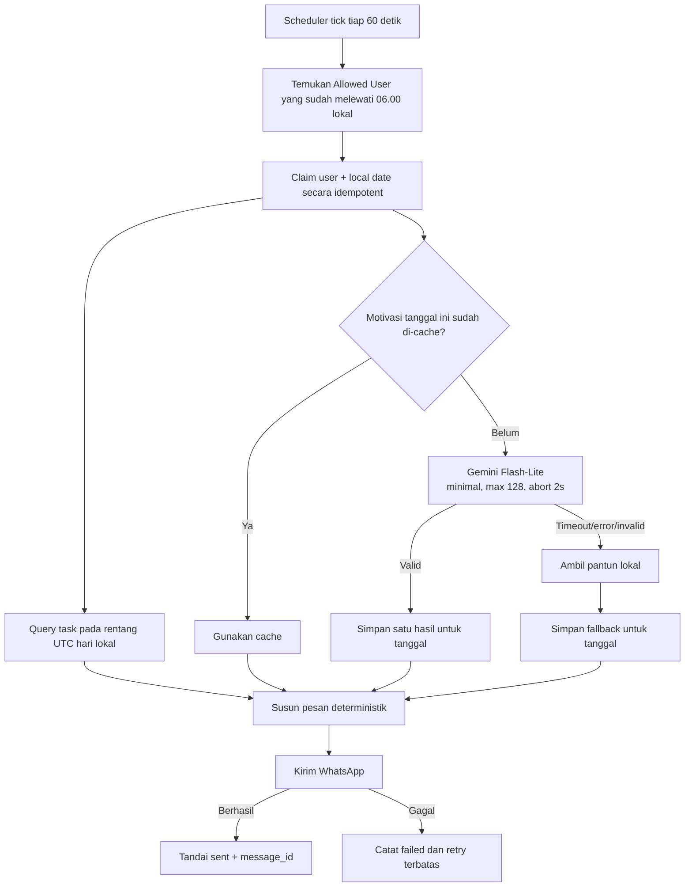

# Riset Daily Morning Task Digest Pukul 06.00

Tanggal riset: 28 September 2026

## Ringkasan keputusan

Fitur yang direkomendasikan adalah **Daily Morning Task Digest** yang default-nya **nonaktif**. Allowed User harus mengaktifkannya sendiri dan dapat mengatur waktu pengiriman; nilai awal setelah diaktifkan adalah pukul 06.00 berdasarkan timezone user. Pesan berisi greeting, task yang deadline-nya jatuh pada tanggal lokal tersebut, diurutkan berdasarkan deadline ascending dengan ID sebagai tie-breaker, lalu ditutup pantun atau kalimat penyemangat singkat.

AI hanya digunakan untuk menghasilkan **satu motivasi generik per tanggal**, bukan satu request per user dan bukan satu request per task. Hasilnya disimpan di database lalu digunakan ulang. Judul task dan data pengguna tidak dikirim ke AI. Jika AI lambat, error, quota habis, atau hasil tidak valid, bot langsung memakai koleksi pantun lokal seperti fallback affirmation yang sudah ada.

Scheduler hanya memproses user dengan `morning_digest_enabled = true`. Jika tidak ada user yang mengaktifkan fitur atau tidak ada user yang due pada tick tersebut, bot tidak menjalankan query task per-user dan tidak memanggil AI.

Rekomendasi konfigurasi AI untuk model project saat ini, `gemini-3.1-flash-lite`:

- `thinkingLevel: minimal`, khusus operasi morning greeting
- `candidateCount: 1`
- `maxOutputTokens: 128`
- timeout aktif melalui `AbortController` sekitar 1,5–2 detik
- maksimal satu attempt AI untuk satu tanggal; tanpa retry sinkron
- output 2–4 baris, maksimal sekitar 240 karakter
- simpan `usageMetadata` bila tersedia

Dengan asumsi prompt sekitar 60 token dan batas output 128 token, satu request per hari memiliki batas kasar sekitar 188 token. Dalam 31 hari, batas kasarnya sekitar 5.828 token, di luar perbedaan tokenizer. Angka aktual harus diambil dari `usageMetadata`; tidak perlu memanggil API `countTokens` sebelum setiap greeting karena itu menambah satu request lagi.

## Kondisi codebase saat ini

Temuan berikut sudah dicocokkan dengan source saat ini:

- `src/bot/client.ts` sudah menjalankan reminder scheduler setiap 60 detik. Morning digest dapat memakai scheduler loop yang sama atau coordinator serupa tanpa dependency cron baru.
- `user_settings.timezone` sudah tersedia dan default-nya `Asia/Jakarta`.
- `listActiveTasks()` sudah mengurutkan deadline ascending lalu ID ascending. PostgreSQL menempatkan deadline null di belakang untuk ascending pada perilaku yang sudah diuji.
- `listActiveTasks()` masih mengambil seluruh task aktif lintas tanggal. Morning digest membutuhkan query baru yang dibatasi ke satu tanggal lokal.
- Task dengan status `pending_deadline` tidak memiliki tanggal dan tidak dapat disebut “task hari ini”. Task tersebut harus dikeluarkan dari daftar utama.
- `generateAffirmation()` sudah memiliki pola Gemini → Antigravity → local JSON. Pola fallback lokalnya dapat dipakai kembali, tetapi Antigravity tidak disarankan dalam jalur sinkron morning digest karena timeout bridge saat ini dapat mencapai 25 detik.
- Call Gemini existing memakai `Promise.race()` untuk timeout, tetapi belum membatalkan request underlying. Morning greeting sebaiknya memakai `AbortSignal` yang didukung `@google/genai`, sehingga timeout benar-benar menghentikan request client.
- Belum ada ledger pengiriman daily digest. Hanya menjalankan `if jam === 06:00` berisiko duplicate ketika beberapa scheduler berjalan, dan berisiko tidak mengirim saat bot restart tepat pada menit tersebut.

## Definisi “task hari ini”

Untuk user dengan timezone `T` dan tanggal lokal `D`, task yang masuk digest adalah:

- `user_jid` milik user tersebut
- `status = 'pending'`
- `deadline >= awal hari D pada timezone T`
- `deadline < awal hari D+1 pada timezone T`

Gunakan interval **half-open** `[start, nextStart)`. Pola ini menghindari masalah nilai `23:59:59.999` dan memastikan task tepat pukul 00.00 hanya masuk satu tanggal.

Task `resolved`, `cancelled`, dan `pending_deadline` tidak masuk daftar. Subtask dengan deadline hari tersebut tetap masuk dan diurutkan secara global berdasarkan waktunya. Jika konteks parent perlu ditampilkan, tampilkan sebagai label kecil tanpa mengubah urutan deadline.

### Task sebelum pukul 06.00

Task hari yang sama dengan deadline antara 00.00 dan 05.59 tetap ditampilkan karena secara kalender masih task hari tersebut. Tandai sebagai `terlewat` dan letakkan lebih dulu. Task sesudah pukul 06.00 mengikuti ascending deadline.

Secara alami, query `ORDER BY deadline ASC, id ASC` menghasilkan:

1. task hari ini yang sudah terlewat, dari waktu paling awal;
2. task mendatang hari ini, dari waktu terdekat;
3. urutan stabil berdasarkan ID jika deadline sama.

Task dari hari sebelumnya tidak dicampur ke morning list. Jika dibutuhkan, tampilkan hanya summary terpisah seperti `Ada 2 task lama yang masih pending`, bukan gabungkan ke urutan task hari ini.

## Bentuk pesan yang disarankan

Contoh dengan task:

```text
🌤️ Selamat pagi, Keva!
Ini agenda kamu untuk Senin, 28 September:

1. 05.30 — Kirim laporan bulanan ⚠️ terlewat
2. 08.00 — Rapat tim produk
3. 13.30 — Bayar tagihan internet

Pagi cerah burung bernyanyi,
Langkah kecil membuka jalan.
Kerjakan satu demi satu hari ini,
Semoga lancar semua urusan. ✨
```

Contoh tanpa task:

```text
🌤️ Selamat pagi, Keva!
Belum ada task terjadwal untuk hari ini. Nikmati pagi dan atur harimu dengan tenang. ✨

Pagi teduh ditemani mentari,
Semoga harimu ringan dan berarti.
```

Aturan formatting:

- gunakan timezone user untuk tanggal dan jam;
- satu task per baris;
- tidak menampilkan detik;
- tetap tampilkan semua task hari itu selama pesan masih di bawah batas aman WhatsApp;
- bila daftar sangat panjang, pecah menjadi beberapa pesan deterministik, misalnya 20 task per pesan, tanpa AI call tambahan;
- pantun hanya pada pesan pertama;
- jangan meminta AI menyusun daftar, mengurutkan task, atau menghitung tanggal.

## Arsitektur yang direkomendasikan



## Penjadwalan yang tahan restart

Jangan memakai pemeriksaan sempit `hour === 6 && minute === 0`. Bot dapat restart, event loop dapat terlambat, database dapat sementara gagal, atau proses dapat memiliki lebih dari satu replica.

Gunakan aturan berikut:

1. Scheduler berjalan setiap 60 detik.
2. Untuk setiap Allowed User yang digest-nya aktif, hitung tanggal dan waktu lokal.
3. User eligible ketika waktu lokal sudah `>= 06:00` dan belum melewati grace window, misalnya pukul 12.00.
4. Buat/claim ledger `(user_jid, local_date)` sebelum mengirim.
5. Unique constraint memastikan hanya satu worker yang memperoleh claim.
6. Jika proses mati saat status `processing`, claim boleh diambil ulang setelah lease timeout, misalnya lima menit.
7. Setelah WhatsApp mengembalikan message ID, update ledger menjadi `sent`.
8. Jika send gagal, simpan `failed`, tambah attempt, dan retry dengan backoff terbatas tanpa memanggil AI lagi.

Grace window membuat bot yang baru hidup pukul 06.07 tetap mengirim digest. Jika bot baru hidup setelah grace window, default yang disarankan adalah skip agar greeting pagi tidak datang siang/sore. Status `missed` tetap dicatat agar dapat dimonitor.

## Skema persistence konseptual

### User settings

Tambahan pengaturan yang disarankan:

| Field | Default | Fungsi |
|---|---:|---|
| `morning_digest_enabled` | `false` | User harus opt-in sebelum scheduler memproses digest |
| `morning_digest_time` | `06:00` | Waktu lokal pengiriman |

Nilai `morning_digest_time` tetap dapat disimpan ketika fitur nonaktif, sehingga waktu pilihan user tidak hilang ketika fitur dimatikan sementara.

### Pengaturan oleh user

Command yang direkomendasikan:

| Command | Hasil |
|---|---|
| `/pagi aktif` | Mengaktifkan digest dengan waktu tersimpan atau default 06.00 |
| `/pagi nonaktif` | Menghentikan digest tanpa menghapus waktu pilihan |
| `/pagi waktu 06:30` | Mengubah waktu pengiriman dalam timezone user |
| `/pagi status` | Menampilkan status aktif/nonaktif, waktu, dan timezone |

Aturan pengaturan:

- hanya Allowed User yang dapat membaca atau mengubah pengaturan;
- waktu wajib berformat `HH:mm` dan valid pada rentang `00:00–23:59`;
- balasan konfirmasi harus menyebut waktu dan timezone agar tidak ambigu;
- perubahan disimpan ke `user_settings`, bukan hanya memory process;
- mengaktifkan fitur atau mengganti waktu ke jam yang sudah lewat berlaku mulai hari berikutnya;
- jika waktu baru masih akan datang dan digest hari itu belum pernah dikirim, user dapat menerima digest pada hari yang sama;
- `/pagi nonaktif` berlaku langsung dan scheduler berikutnya harus melewati user tersebut;
- command berulang harus idempotent, misalnya `/pagi aktif` pada fitur yang sudah aktif tidak membuat delivery tambahan.

### Delivery ledger

Tabel konseptual `daily_digest_deliveries`:

| Field | Fungsi |
|---|---|
| `id` | primary key |
| `user_jid` | pemilik digest |
| `local_date` | tanggal kalender user |
| `timezone` | snapshot timezone saat claim |
| `status` | `processing`, `sent`, `failed`, `missed` |
| `attempt_count` | jumlah send attempt |
| `claimed_at` | awal lease |
| `sent_at` | waktu berhasil |
| `message_id` | ID message WhatsApp bila berhasil |
| `task_count` | jumlah task dalam digest |
| `motivation_source` | `gemini`, `cache`, atau `local` |
| `error_code` | kode aman, tanpa isi task |

Unique constraint: `(user_jid, local_date)`.

### Motivation cache

Tabel konseptual `daily_motivations`:

| Field | Fungsi |
|---|---|
| `local_date` | tanggal isi motivasi |
| `locale` | misalnya `id-ID` |
| `style` | misalnya `pantun` |
| `text` | output yang sudah divalidasi |
| `source` | `gemini` atau `local` |
| `model` | model bila source AI |
| `prompt_tokens` | optional |
| `output_tokens` | optional |
| `thought_tokens` | optional |
| `total_tokens` | optional |
| `created_at` | timestamp UTC |

Unique constraint `(local_date, locale, style)` memastikan restart atau multi-replica tidak membuat AI request berulang. Untuk instalasi satu timezone, semua user memakai satu motivasi per tanggal.

## Strategi AI yang hemat dan cepat

### Prompt

Prompt tidak perlu menyertakan task:

```text
Buat satu pantun penyemangat pagi Bahasa Indonesia, 4 baris, hangat dan natural.
Maksimal 220 karakter. Hindari kutipan, markdown, nasihat panjang, dan klaim tentang agenda pengguna.
Balas hanya isi pantun.
```

Prompt pendek menurunkan input token dan menghindari kebocoran data task. Satu candidate sudah cukup.

### Thinking dan output cap

Dokumentasi Gemini menyatakan `thinkingLevel: low` mengurangi latency dan biaya, dan `minimal` didukung serta menjadi default untuk Gemini 3.1/3.5 Flash-Lite. Untuk pantun sederhana, gunakan `minimal` secara eksplisit pada operasi ini. Jangan memakai nilai global `GEMINI_THINKING_LEVEL=MEDIUM` untuk greeting.

Gunakan `maxOutputTokens: 128` sebagai guardrail. Google mengingatkan bahwa batas output juga mencakup thought tokens; batas yang terlalu kecil dapat menghasilkan output kosong atau terpotong. Kombinasi `minimal` dan 128 token lebih aman daripada memaksa batas sangat kecil.

### Timeout yang benar

`Promise.race()` hanya menghentikan penantian caller; request underlying dapat terus berjalan. Gunakan `AbortController` dan berikan `abortSignal` pada `GenerateContentConfig`, lalu abort sekitar 1,5–2 detik.

Tidak perlu retry AI pada jalur pukul 06.00. Retry dapat memperlambat pesan dan memakai token tambahan. Jika attempt tunggal gagal, gunakan fallback lokal dan simpan fallback tersebut sebagai cache tanggal itu.

### Mengapa Antigravity dilewati

Antigravity bridge berguna sebagai fallback NLP, tetapi timeout 25 detik terlalu mahal untuk greeting sederhana. Morning digest direkomendasikan memakai dua tier saja:

1. Gemini Flash-Lite dengan deadline pendek;
2. pantun lokal.

Ini menjaga waktu pengiriman tetap konsisten dan menghindari proses CLI berat pada pukul 06.00.

### Validasi output

Terima output AI hanya bila:

- panjang 20–240 karakter;
- memiliki 2–4 baris non-empty;
- tidak memiliki code fence, JSON, URL, atau heading;
- tidak mengandung placeholder seperti `[nama]` atau `{task}`;
- tidak menyebut informasi agenda yang tidak diberikan;
- tidak kosong atau terpotong karena `MAX_TOKENS`.

Jika gagal validasi, gunakan fallback lokal. Jangan melakukan repair call kedua.

## Fallback lokal

Buat file data terpisah, misalnya `src/data/morning-motivations.json`, berisi 20–30 pantun dan greeting terkurasi. Jangan mencampurnya dengan affirmation selesai-task karena konteks dan tone berbeda.

Pemilihan fallback sebaiknya deterministik berdasarkan tanggal, misalnya hash tanggal modulo jumlah item. Dengan cara ini:

- restart pada hari yang sama menghasilkan teks yang sama;
- test tidak flaky;
- tidak memerlukan random generator atau database call tambahan.

Fallback lokal adalah bagian utama reliability, bukan hanya emergency copy. Digest tetap harus dikirim meskipun semua provider AI tidak tersedia.

## Beban server dan token

### Database

Per user per hari, jalur normal membutuhkan kira-kira:

- satu claim ledger;
- satu query task berbatas tanggal dan user;
- satu atau beberapa WhatsApp send sesuai panjang daftar;
- satu update ledger;
- motivation cache dibaca sekali dan dibuat maksimal sekali per tanggal.

Tambahkan composite index yang mendukung query utama, kandidatnya `(user_jid, status, deadline, id)`. Keputusan index final harus menggunakan `EXPLAIN ANALYZE` pada data representatif.

### AI

Untuk satu motivation global per hari:

- generate secara lazy hanya setelah ditemukan minimal satu user opt-in yang due;
- maksimal 1 request/hari;
- maksimal 31 request/bulan;
- prompt tidak bertambah mengikuti jumlah task atau user;
- output dibatasi 128 token;
- tidak ada AI call ketika cache sudah ada;
- tidak ada retry AI pada jalur pengiriman;
- usage token dicatat dari response bila tersedia.

Rate limit Gemini diukur antara lain dengan request per minute, input tokens per minute, dan request per day. Satu request per tanggal berada sangat jauh di bawah pola burst, tetapi quota aktual tetap harus dilihat di Google AI Studio karena bergantung model dan tier.

## Error handling

- Failure query task: jangan kirim pesan seolah daftar kosong; tandai failed dan retry terbatas.
- Failure AI: gunakan local fallback tanpa menunda digest.
- Failure WhatsApp send: retry message yang sama; jangan generate pantun baru.
- Bot disconnected: ledger tetap belum `sent`; retry setelah koneksi pulih selama masih dalam grace window.
- Crash setelah send tetapi sebelum update ledger: ada risiko duplicate karena message send dan DB update bukan satu transaksi. Mitigasi praktis adalah simpan stable idempotency key/attempt state dan cek message outcome jika Baileys menyediakan bukti yang memadai. Risiko ini tidak dapat dihilangkan sepenuhnya dengan transaksi PostgreSQL saja.
- Multiple replicas: unique claim + lease wajib; in-memory flag tidak cukup.
- Satu user gagal: lanjutkan user berikutnya, konsisten dengan seam reminder existing.

## Telemetry yang perlu dicatat

Fitur ini cocok dengan rancangan dashboard monitoring sebelumnya:

- `morning_digest_due_total`
- `morning_digest_sent_total`
- `morning_digest_failed_total{error_code}`
- `morning_digest_missed_total`
- `morning_digest_task_count`
- `morning_digest_duration_ms`
- `morning_motivation_total{source=gemini|cache|local}`
- `morning_motivation_latency_ms`
- `morning_motivation_tokens_total{kind=prompt|output|thought|total}`

Jangan gunakan JID, local date, task ID, atau task title sebagai metric labels.

## Acceptance criteria

### Perilaku

- Fitur default nonaktif untuk user baru maupun Allowed User existing saat migration diterapkan.
- User yang belum opt-in tidak memicu query task, pembuatan delivery ledger, WhatsApp send, atau AI call.
- Allowed User yang mengaktifkan digest mendapat maksimal satu digest per tanggal lokal.
- User dapat mengaktifkan, menonaktifkan, melihat status, dan mengubah waktu digest melalui command WhatsApp.
- Digest dikirim pertama kali pada scheduler tick setelah waktu lokal pilihan user; default setelah aktivasi adalah pukul 06.00.
- Bot yang restart setelah waktu pilihan user tetapi masih dalam grace window tetap mengirim.
- Task hanya berasal dari tanggal lokal tersebut dan status `pending`.
- Urutan selalu `deadline ASC, id ASC`.
- Task sebelum 06.00 ditandai terlewat dan tetap berada sesuai urutan waktunya.
- Task dengan deadline sama memiliki urutan stabil.
- Tidak ada AI call per task atau per user.
- AI gagal atau timeout tidak menggagalkan digest.
- Tidak ada task text, JID, atau nama user yang dikirim ke AI.

### Performa

- AI hanya satu attempt per tanggal dan selalu memakai cache setelahnya.
- Deadline AI maksimum 2 detik; fallback lokal selesai tanpa network.
- Scheduler tidak menunggu user secara serial tanpa batas. Gunakan concurrency kecil dan terbatas, misalnya 2–4 send, bila jumlah user bertambah.
- Tidak ada overlap cycle: tick baru tidak memulai scan kedua selama cycle sebelumnya masih aktif.
- Query task memakai date range dan index; tidak melakukan filter tanggal dengan fungsi pada kolom `deadline` bila itu menghalangi penggunaan index.

### Test minimum saat implementasi

- default nonaktif untuk user baru dan user existing setelah migration;
- scheduler tidak melakukan AI call atau query task per-user ketika tidak ada opt-in user yang due;
- command aktif, nonaktif, status, format waktu valid/invalid, dan unauthorized user;
- aktivasi atau perubahan waktu sebelum jadwal, setelah jadwal, dan setelah digest hari itu sudah terkirim;
- exact 06.00, 06.01, sebelum 06.00, dan sesudah grace window;
- restart setelah 06.00;
- duplicate scheduler tick dan dua worker concurrent;
- timezone Asia/Jakarta serta satu timezone non-UTC+7;
- batas hari 00.00 dan awal hari berikutnya;
- task sebelum 06.00, sesudah 06.00, deadline sama, null deadline, resolved, dan cancelled;
- AI success, timeout dengan abort, invalid output, quota error, dan cache hit;
- crash/stale processing lease;
- WhatsApp send failure dan retry tanpa AI call baru;
- daftar kosong dan daftar panjang yang perlu dipecah.

## Tahapan implementasi yang disarankan

Riset ini belum mengubah source aplikasi. Implementasi paling aman dibagi menjadi:

1. query `listTasksForLocalDate()` dan test boundary/order;
2. local morning motivation generator dan formatter pesan;
3. delivery ledger, unique constraint, claim, stale lease, dan test idempotency;
4. scheduler 06.00 + grace window;
5. Gemini daily cache dengan `minimal`, abort, output validation, dan token metadata;
6. telemetry dan integration test WhatsApp sender;
7. benchmark query dan observasi minimal 24 jam sebelum menilai overhead produksi.

## Keputusan product

Keputusan yang sudah dikonfirmasi:

- fitur default nonaktif;
- hanya user yang mengaktifkan fitur yang diproses scheduler;
- user dapat menonaktifkan dan mengatur waktu pengiriman sendiri;
- waktu default ketika pertama kali diaktifkan adalah pukul 06.00 pada timezone user.

Satu perilaku yang masih dapat dipilih saat implementasi adalah apakah hari tanpa task tetap mengirim greeting. Rekomendasi riset tetap:

- tetap kirim greeting singkat saat tidak ada task untuk user yang sudah opt-in;
- user dapat menghentikannya kapan saja dengan `/pagi nonaktif`.

## Sumber primer

- [Google Gen AI SDK `GenerateContentConfig`](https://googleapis.github.io/js-genai/release_docs/interfaces/types.GenerateContentConfig.html)
- [Gemini thinking level dan output token limits](https://ai.google.dev/gemini-api/docs/generate-content/thinking)
- [Gemini token counting dan usage metadata](https://ai.google.dev/gemini-api/docs/tokens)
- [Gemini API rate limits](https://ai.google.dev/gemini-api/docs/rate-limits)
- [Drizzle ORM select filters dan ordering](https://orm.drizzle.team/docs/select)
- [Drizzle ORM transactions](https://orm.drizzle.team/docs/transactions)
- [PostgreSQL `INSERT ... ON CONFLICT`](https://www.postgresql.org/docs/current/sql-insert.html)
- [PostgreSQL date/time dan `AT TIME ZONE`](https://www.postgresql.org/docs/current/functions-datetime.html)
