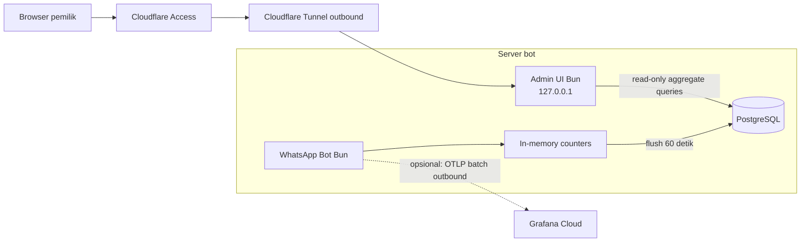

# Riset Dashboard Monitoring Ringan untuk WhatsApp Task & Reminder Bot

Tanggal riset: 28 September 2026

## Ringkasan keputusan

Rekomendasi utama adalah membuat **dashboard admin read-only yang berjalan di proses Bun yang sama**, menyimpan telemetry terstruktur ke PostgreSQL yang sudah digunakan aplikasi, dan membuka dashboard melalui **Cloudflare Tunnel + Access**. Desain ini tidak memerlukan container Grafana, Prometheus, Loki, atau database baru di server bot.

Grafana Cloud dapat ditambahkan pada tahap berikutnya untuk alert, histori time-series, dan observabilitas lintas service. Ekspor sebaiknya hanya berisi metrik agregat tanpa JID, isi pesan, nama task, prompt, respons AI, nama file, atau OCR text.

Self-hosted Grafana + Prometheus + Loki tidak direkomendasikan untuk server kecil. Dokumentasi Grafana menetapkan minimum 512 MB RAM dan 1 CPU core untuk Grafana saja; metric store, log store, dan trace backend membutuhkan resource terpisah. Grafana Cloud menghilangkan komponen berat itu dari host dan memiliki free tier yang saat ini mencakup 10.000 metric series serta masing-masing 50 GB logs dan traces dengan retensi 14 hari.

## Tujuan dashboard

Dashboard perlu menjawab empat pertanyaan operasional:

1. Apakah bot, WhatsApp socket, database, dan reminder scheduler sehat?
2. Berapa banyak pesan, task, reminder, attachment, dan AI request yang diproses?
3. Di mana kegagalan, timeout, dan fallback paling sering terjadi?
4. Berapa pemakaian token AI tanpa menyimpan isi percakapan pengguna?

Dashboard bukan alat untuk membaca percakapan WhatsApp, prompt, OCR text, atau kredensial. Data sensitif tersebut tidak diperlukan untuk mengetahui kesehatan dan penggunaan sistem.

## Kondisi codebase saat ini

Temuan diverifikasi terhadap source saat ini, bukan hanya graph project:

- `src/bot/client.ts` sudah memakai Pino untuk sebagian lifecycle Baileys, tetapi service lain masih banyak memakai `console.log`, `console.warn`, dan `console.error`.
- Handler pesan saat ini mencetak JID dan teks pesan mentah. Log seperti ini tidak boleh langsung dikirim ke layanan observability eksternal.
- Listener pesan dan reaksi sudah menangkap exception agar socket tidak crash. Ini adalah titik yang tepat untuk counter keberhasilan dan kegagalan handler.
- Scheduler berjalan setiap 60 detik. `checkAndDispatchReminders()` melanjutkan task berikutnya ketika satu dispatch gagal, tetapi exception per-task saat ini ditelan tanpa log atau counter. Dashboard tidak akan dapat melihat kegagalan ini sebelum instrumentation ditambahkan.
- NLP memiliki tiga tier: Gemini, Antigravity bridge, lalu parser lokal. Saat ini tidak ada counter tier yang terpilih, latency, timeout, atau token usage.
- Reminder message dan affirmation juga memiliki jalur Gemini/Antigravity/local fallback, tetapi hasil provider belum dicatat secara terstruktur.
- PostgreSQL sudah menyimpan `tasks`, `task_messages`, `task_attachments`, `task_history`, dan `user_settings`. Belum ada tabel telemetry.
- Bot utama belum memiliki health endpoint. Antigravity bridge sudah memiliki `GET /health`.
- Arsitektur saat ini sengaja tidak membuka public inbound HTTP port. Dashboard harus mempertahankan batas ini dengan bind ke loopback/private network dan akses melalui tunnel berautentikasi.

## Opsi yang dibandingkan

| Opsi | Beban pada server bot | Data domain | Web UI | Operasional | Keputusan |
|---|---:|---|---|---|---|
| Bun dashboard + PostgreSQL existing | Paling rendah; tidak menambah runtime utama atau database | Sangat baik; dapat menampilkan task aggregate dan telemetry khusus bot | Dibangun sesuai kebutuhan | Perlu implementasi dan maintenance UI kecil | **Direkomendasikan untuk tahap pertama** |
| Grafana Cloud + metric push | Rendah sampai sedang; SDK/exporter melakukan batch outbound | Baik untuk metric, alert, dan tren; kurang cocok untuk raw task data | Sangat matang | Perlu akun dan konfigurasi exporter | **Direkomendasikan sebagai tahap opsional kedua** |
| Self-hosted Grafana + Prometheus | Sedang sampai tinggi | Baik untuk metric | Sangat matang | Tambah beberapa service, storage, retention, backup, dan upgrade | Tidak disarankan untuk server kecil |
| Self-hosted Grafana + Prometheus + Loki/Tempo | Tinggi | Lengkap untuk metric, log, trace | Sangat matang | Paling kompleks dan resource intensive | Tidak disarankan saat ini |
| Adminer/pgAdmin/DB browser | Bervariasi | Menampilkan raw database terlalu luas | Ada | Risiko akses dan perubahan data lebih tinggi | Tidak cocok sebagai dashboard operasional |
| Uptime-only monitor | Rendah | Hanya availability/health | Ada | Mudah | Pelengkap saja; tidak menjawab penggunaan bot |

## Arsitektur yang direkomendasikan

### Mengapa desain ini ringan

- `Bun.serve` menyediakan HTTP server dan routing tanpa framework tambahan.
- Dashboard memakai proses Bun dan koneksi PostgreSQL yang sudah ada.
- Counter murah disimpan di memory dan di-flush per 60 detik atau saat shutdown, bukan melakukan insert pada setiap event yang sangat sering.
- Query dashboard hanya berjalan ketika UI dibuka, dengan refresh minimum 60 detik dan response cache 30–60 detik.
- Tabel transaksi tidak dipindai terus-menerus. Statistik historis dibaca dari bucket per jam/hari.
- Cloudflare Tunnel membuat koneksi outbound dan Access melakukan autentikasi browser, sehingga port dashboard tidak perlu dipublikasikan langsung.

## Data yang perlu ditampilkan

### 1. Status sistem

- status WhatsApp: `connected`, `reconnecting`, atau `logged_out`
- waktu koneksi terakhir dan jumlah reconnect
- process uptime, RSS memory, dan CPU usage
- status database dan latency ping
- waktu scheduler terakhir dimulai, selesai, dan berhasil
- umur heartbeat terakhir
- status Antigravity bridge bila diaktifkan

### 2. Penggunaan bot

- pesan masuk per jam/hari, dipisahkan menjadi text, command, image, document, dan reaction
- pesan yang ditolak karena user tidak diizinkan
- task dibuat, resolved, cancelled, rescheduled
- jumlah task aktif, overdue, dan pending deadline
- reminder regular dan overdue yang berhasil/gagal
- attachment count dan total byte menurut jenis/storage driver
- attachment rejected/suspicious/failed processing

### 3. Penggunaan AI dan fallback

- jumlah call menurut operasi: `nlp_parse`, `reminder_message`, `affirmation`, `media_analysis`
- provider/tier: `gemini`, `antigravity`, `local`
- outcome: `success`, `timeout`, `invalid_response`, `provider_error`, `fallback`
- latency histogram atau bucket: `<250 ms`, `<1 s`, `<3 s`, `<10 s`, `>=10 s`
- prompt, candidate, thought, dan total token bila provider mengembalikannya
- fallback rate dan timeout rate
- model name/version bila tersedia, dengan cardinality yang dibatasi

Google Gen AI SDK mengekspos `usageMetadata` pada response, termasuk `promptTokenCount`, `candidatesTokenCount`, `thoughtsTokenCount`, dan `totalTokenCount`. Dukungan aktual perlu diuji terhadap mode Gemini API yang dipakai project karena dokumentasi type juga memberi catatan perbedaan dukungan antar-backend.

### 4. Error ringkas

- jumlah error menurut `component`, `operation`, dan `error_code`
- waktu error terakhir
- pesan error yang sudah disanitasi dan dibatasi panjangnya
- tidak menyimpan stack/payload mentah secara default bila mengandung JID, task text, path attachment, prompt, atau response AI

## Penyimpanan telemetry yang disarankan

Gunakan dua tingkat retensi:

### Event penting

Tabel konseptual `telemetry_events` untuk event yang perlu investigasi:

| Kolom | Isi |
|---|---|
| `occurred_at` | timestamp UTC |
| `component` | `whatsapp`, `router`, `scheduler`, `nlp`, `media`, `db` |
| `operation` | nama operasi yang cardinality-nya dibatasi |
| `provider` | `gemini`, `antigravity`, `local`, atau null |
| `outcome` | `success`, `failed`, `timeout`, `fallback` |
| `duration_ms` | latency, bila relevan |
| `prompt_tokens` | integer nullable |
| `output_tokens` | integer nullable |
| `total_tokens` | integer nullable |
| `error_code` | kode stabil, bukan pesan exception mentah |
| `attributes` | JSON kecil yang lolos allowlist |

Retensi yang disarankan: 30 hari. Hapus secara batch harian, bukan per-request.

### Bucket agregat

Tabel konseptual `telemetry_hourly`:

| Kolom | Isi |
|---|---|
| `bucket_at` | awal jam UTC |
| `metric` | nama metric yang di-allowlist |
| `dimension` | kombinasi dimensi rendah, misalnya provider + outcome |
| `count` | jumlah event |
| `sum_value` | total duration/token/byte bila relevan |
| `max_value` | nilai maksimum bila relevan |

Gunakan unique key `(bucket_at, metric, dimension)` dan upsert per flush. Retensi 12 bulan cukup untuk tren tanpa pertumbuhan event mentah tanpa batas.

Untuk traffic bot yang sangat rendah, event insert langsung juga layak. Namun buffer + hourly upsert memberi batas beban yang lebih jelas dan tetap hemat saat traffic bertambah. Kerugiannya adalah kehilangan telemetry paling banyak satu interval flush jika proses mati mendadak; event error kritis dapat ditulis langsung untuk mengurangi gap tersebut.

## Query dashboard

Halaman awal cukup memiliki empat panel:

1. **Health**: WhatsApp, DB, scheduler, uptime, RAM.
2. **Hari ini**: messages, task created/resolved, reminder success/failure, AI calls/tokens.
3. **Tren 7/30 hari**: task completion rate, reminder failure, fallback AI, latency.
4. **Recent errors**: hanya metadata yang sudah disanitasi.

Aturan query:

- refresh default 60 detik; tidak menyediakan refresh 1–5 detik
- cache endpoint summary selama 30–60 detik
- semua list memakai pagination dan hard limit
- aggregate historis membaca `telemetry_hourly`
- query tabel `tasks` langsung hanya untuk snapshot kecil seperti jumlah status saat ini
- tambahkan index berdasarkan hasil `EXPLAIN ANALYZE`, bukan asumsi; kandidat awal adalah waktu bucket/event serta status dan waktu task
- dashboard connection memakai role PostgreSQL read-only untuk tabel domain; writer telemetry tetap menjadi tanggung jawab aplikasi bot

## Privasi dan keamanan

Jangan gunakan nilai berikut sebagai metric label, log field remote, URL, atau filter dashboard:

- `user_jid`, nomor WhatsApp, atau nama pengguna
- `task_id`, `message_id`, dan attachment hash sebagai label time-series
- task text, raw input, OCR text, prompt, atau response model
- nama file, storage path, API key, auth state, atau content media

Alasannya bukan hanya privasi. Nilai unik menghasilkan high cardinality dan dapat meningkatkan penggunaan memory/storage pada metric backend.

Dashboard harus:

- bind ke `127.0.0.1` atau private network, bukan `0.0.0.0` publik
- ditempatkan di belakang Cloudflare Access atau private VPN
- bersifat read-only; tidak menyediakan edit/delete task pada fase monitoring
- memakai `Cache-Control: no-store` untuk halaman/API yang sensitif
- memiliki timeout query, response size limit, pagination, dan rate limit
- memvalidasi identity header dari access proxy hanya jika request dipastikan datang melalui tunnel/proxy terpercaya
- tidak memberikan raw SQL console atau database credentials ke browser

## Posisi Grafana Cloud dan OpenTelemetry

OpenTelemetry JavaScript memiliki status stable untuk traces dan metrics, sementara logs masih berstatus development. SDK mendukung periodic metric export melalui OTLP, sehingga aplikasi dapat push data outbound tanpa membuka endpoint scrape.

Namun dokumentasi resmi OpenTelemetry JavaScript menyatakan dukungan runtime untuk versi Node.js LTS; Bun tidak tercantum sebagai runtime yang diuji. Karena project ini berjalan di Bun, integrasi SDK OpenTelemetry harus melalui proof of concept kecil dan test shutdown/export. Jangan menjadikannya dependency inti sebelum kompatibilitas runtime terbukti.

Jika proof of concept berhasil, gunakan:

- metrics saja pada tahap awal
- export interval 60 detik
- concurrency limit 1
- timeout pendek dan failure non-blocking
- `forceFlush()`/`shutdown()` saat SIGTERM
- low-cardinality attributes
- tidak mengekspor logs mentah sebelum redaction terpusat selesai

Grafana Alloy tidak wajib untuk satu proses bot. Direct OTLP push lebih ringan karena tidak menambah collector process. Alloy baru relevan jika kelak ada beberapa service/container, file logs, host metrics, retry queue yang lebih kuat, atau routing ke lebih dari satu backend.

## Mengapa tidak langsung self-host Grafana stack

Self-hosted Grafana saja membutuhkan minimum 512 MB RAM dan 1 CPU core menurut dokumentasi resmi. Dokumentasi juga menegaskan bahwa kebutuhan ini belum mencakup Prometheus, Loki, Tempo, atau data source lain. Untuk bot personal/small traffic, resource dan maintenance tersebut tidak sebanding dengan kebutuhan awal.

Prometheus memang efisien untuk penyimpanan sample dan menyediakan size retention, tetapi tetap menambah proses, WAL, local time-series database, scrape lifecycle, backup/retention policy, dan public/private metrics endpoint. Ia lebih tepat ketika host sudah menjalankan beberapa service dan kebutuhan alert/time-series melampaui dashboard sederhana.

## Tahapan implementasi yang disarankan

Riset ini belum mengubah source aplikasi. Jika dilanjutkan, urutannya:

### Fase 1 — instrumentation minimal

- satu interface telemetry vendor-neutral
- counter in-memory dan PostgreSQL sink
- health snapshot untuk WhatsApp, DB, scheduler, dan process
- instrumentation pada message/reaction handler, task lifecycle, reminder dispatch, NLP, affirmation, dan media
- redaction policy serta unit test untuk memastikan field sensitif tidak tersimpan

### Fase 2 — web UI read-only

- `Bun.serve` dengan endpoint health, summary, trend, dan errors
- static HTML/CSS/JS kecil tanpa frontend framework
- refresh 60 detik, cache server-side, pagination, dan query timeout
- bind loopback/private network
- Cloudflare Tunnel + Access

### Fase 3 — optional hosted observability

- proof of concept OTLP metrics pada Bun
- Grafana Cloud dashboard dan alert untuk bot disconnected, scheduler stale, reminder failure, DB failure, dan AI fallback spike
- ukur overhead sebelum dan sesudah; pertahankan sink PostgreSQL sebagai source operasional lokal

## Batas resource dan acceptance criteria

Angka berikut adalah target implementasi yang harus diukur pada server sebenarnya, bukan klaim performa saat ini:

- tidak menambah database atau observability container pada Fase 1–2
- dashboard idle tidak menjalankan polling jika tidak ada browser aktif
- refresh minimum 60 detik dan maksimal satu request summary per browser per interval
- flush telemetry maksimal satu transaksi per 60 detik dalam kondisi normal
- kegagalan telemetry tidak boleh menggagalkan pesan, reminder, atau shutdown bot
- telemetry queue memiliki batas keras; ketika penuh, drop metric dengan counter `telemetry_dropped_total`
- raw event retention 30 hari dan aggregate retention 12 bulan
- benchmark sebelum/sesudah mencatat RSS, CPU idle/load, p95 event handling, DB query p95, dan pertumbuhan storage per hari
- deployment diterima hanya bila tidak ada regresi bermakna pada message handling dan reminder scheduler; threshold numerik ditentukan setelah baseline server direkam selama minimal 24 jam

## Risiko dan batasan

- Graphify yang tersedia membantu menemukan titik integrasi, tetapi graph dapat tertinggal dari source. Temuan akhir sudah dicocokkan dengan source saat ini.
- PostgreSQL sink menambah write kecil. Buffer dan hourly upsert membatasi frekuensinya, tetapi tetap perlu diukur pada server produksi.
- Telemetry buffer dapat kehilangan data terakhir ketika proses crash. Ini dapat diterima untuk metrik, tetapi event kritis dapat ditulis langsung.
- Custom dashboard perlu dipelihara. Scope harus tetap read-only dan kecil agar tidak berkembang menjadi aplikasi admin kedua.
- Cloudflare Tunnel/Access menambah dependency eksternal dan satu connector process. Alternatifnya adalah akses private melalui VPN/Tailscale tanpa public hostname.
- Token metadata bergantung pada provider dan response aktual. Field SDK harus dianggap optional dan diverifikasi melalui test live yang tidak menyimpan konten.

## Sumber primer

- [Bun HTTP server dan built-in routing](https://bun.sh/docs/runtime/http/server)
- [Grafana installation dan minimum hardware](https://grafana.com/docs/grafana/latest/setup-grafana/installation/)
- [Grafana Cloud overview dan free tier](https://grafana.com/docs/grafana/latest/introduction/grafana-cloud/)
- [Grafana Cloud pricing](https://grafana.com/pricing/)
- [Prometheus local storage dan retention](https://prometheus.io/docs/prometheus/latest/storage/)
- [OpenTelemetry JavaScript status dan runtime support](https://opentelemetry.io/docs/languages/js/)
- [OpenTelemetry JavaScript OTLP metrics exporter](https://github.com/open-telemetry/opentelemetry-js/blob/main/experimental/packages/opentelemetry-exporter-metrics-otlp-http/README.md)
- [Grafana Alloy OTLP ke Grafana Cloud](https://github.com/grafana/alloy/blob/main/docs/sources/collect/opentelemetry-to-lgtm-stack.md)
- [Google Gen AI SDK usage metadata](https://googleapis.github.io/js-genai/release_docs/classes/types.GenerateContentResponseUsageMetadata.html)
- [Cloudflare Access untuk private web application](https://developers.cloudflare.com/cloudflare-one/setup/secure-private-apps/)

